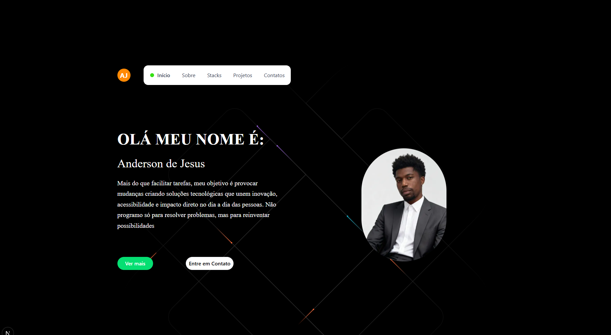

# 🌟 Portfólio Profissional – Desenvolvedor Front-End

<p align="center">
  <a href="https://portfolio-psi-seven-cxv8rjl4ks.vercel.app/">
    
  </a>
  
  
  
</p>

## 🖥️ Preview do Projeto

<p align="center">
  
</p>


## 🚀 Deploy

 https://portfolio-psi-seven-cxv8rjl4ks.vercel.app/

---
<br>

## 📌 Sobre

Este portfólio foi desenvolvido como uma vitrine profissional para apresentar:

- Experiência profissional  
- Projetos desenvolvidos  
- Soft skills  
- Certificações  
- Contato direto  

O design segue uma paleta minimalista em **preto e branco com destaques em verde e azul**, garantindo contraste elegante e identidade visual marcante.

---

## 🧠 Funcionalidades

✔️ Navegação fluida  
✔️ Cards interativos com redirecionamento  
✔️ Página de certificados  
✔️ Download de currículo em PDF  
✔️ Layout 100% responsivo  
✔️ Estrutura organizada e escalável  

---

## 🛠️ Tecnologias Utilizadas

- Next.js  
- TypeScript  
- Tailwind CSS  

---

## 📥 Como Executar Localmente

```bash
# Instalar dependências
npm install

# Rodar ambiente de desenvolvimento
npm run dev